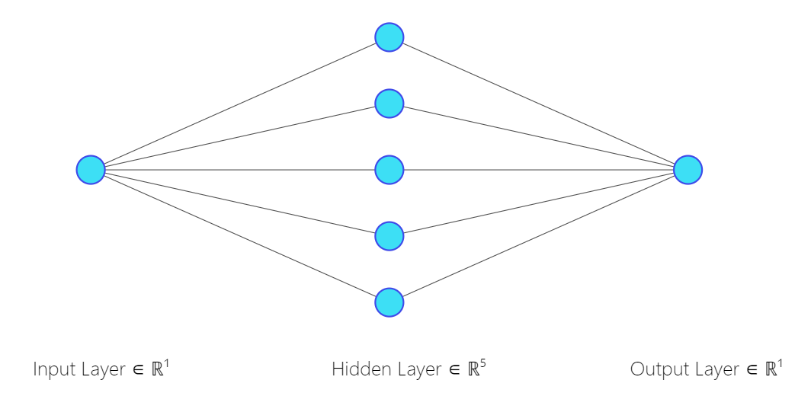

# Developing a Neural Network Regression Model

## AIM

To develop a neural network regression model for the given dataset.

## THEORY
<div style="font-size: 40px">
<b>
A Neural Network is a computational model inspired by the structure and function of the human brain. It consists of interconnected nodes, or neurons, organized into layers. Information flows through these neurons, with each neuron receiving input, processing it, and passing the output to the next layer of neurons. The connections between neurons are governed by weights, which determine the strength of the connections.
<br>
<br>
<hr>
The  neural network regression model for data stored in a Google Sheets document. It begins by fetching the data and converting it into a Pandas DataFrame, followed by preprocessing steps like type conversion and splitting the data into training and testing sets. The input features are scaled using MinMaxScaler to ensure uniformity. Subsequently, a sequential neural network model is built using TensorFlow/Keras, comprising an input layer, two hidden layers employing the Rectified Linear Unit (ReLU) activation function, and an output layer. The model is compiled with the 'rmsprop' optimizer and mean squared error (MSE) loss function. Training is conducted on the training data for 5000 epochs, with the model's architecture and training history visualized for analysis. Evaluation on the testing data assesses the model's performance, and a sample input is processed to predict the corresponding output. This process demonstrates a fundamental approach to constructing and training a neural network regression model for predictive analysis of given data.
</b>
</div>

## Neural Network Model



## DESIGN STEPS

### STEP 1:

Loading the dataset

### STEP 2:

Split the dataset into training and testing

### STEP 3:

Create MinMaxScalar objects ,fit the model and transform the data.

### STEP 4:

Build the Neural Network Model and compile the model.

### STEP 5:

Train the model with the training data.

### STEP 6:

Plot the performance plot

### STEP 7:

Evaluate the model with the testing data.

## PROGRAM
### NAME : MOHAMED ROSHAN S
### REGISTER NUMBER : 212222040101
```py

#import authentication modules

import pandas as pd
from google.colab import auth
import gspread
from google.auth import default

# authenticate user

auth.authenticate_user()
creds, _ = default()
gc = gspread.authorize(creds)

# import required libraries

from sklearn.model_selection import train_test_split
from sklearn.preprocessing import MinMaxScaler
from tensorflow.keras.models import Sequential
from tensorflow.keras.layers import Dense
import tensorflow as tf
tf.__version__

# reading the dataset and convert into dataframe

worksheet = gc.open('datasetforex1').sheet1
rows = worksheet.get_all_values()
df = pd.DataFrame(rows[1:], columns=rows[0])

#showing first five samples

df.head()

df[['input', 'output']] = df[['input', 'output']].astype(float)
df.head()

X=df[['input']].values
y=df[['output']].values

x_train,x_test,y_train,y_test=train_test_split(X,y,test_size=0.33,random_state=50)

scaler=MinMaxScaler()
scaler.fit(x_train)
x_train_scaled = scaler.transform(x_train)
x_train_scaled

ai_brain = Sequential([
    Dense(units = 1, activation = 'relu', input_shape=[1]),
    Dense(units = 5, activation = 'relu'),
    Dense(units = 1)
])

ai_brain.compile(optimizer='rmsprop',loss='mse')

ai_brain.fit(x=x_train_scaled,y=y_train,epochs=4000)

ai_brain.summary()

loss_df = pd.DataFrame(ai_brain.history.history)
loss_df.plot()

x_test1 = scaler.transform(x_test)

ai_brain.evaluate(x_test1,y_test)

X_n1 = [[30]]
X_n1_1 = scaler.transform(X_n1)
ai_brain.predict(X_n1_1)


```
## Dataset Information


## OUTPUT

### Training Loss Vs Iteration Plot


### Test Data Root Mean Squared Error


### New Sample Data Prediction


## RESULT

Thus to develop a neural network regression model for the dataset created is successfully executed.

